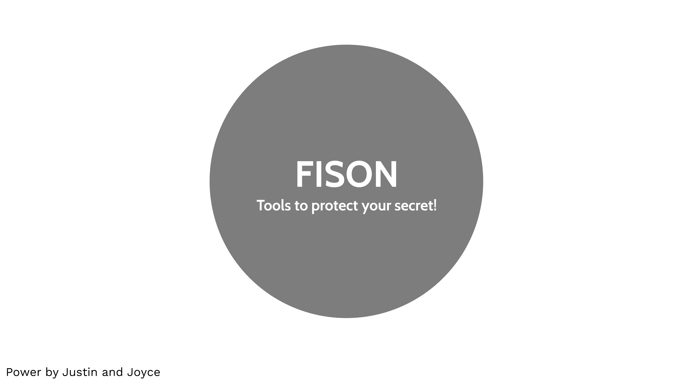
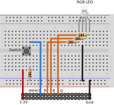
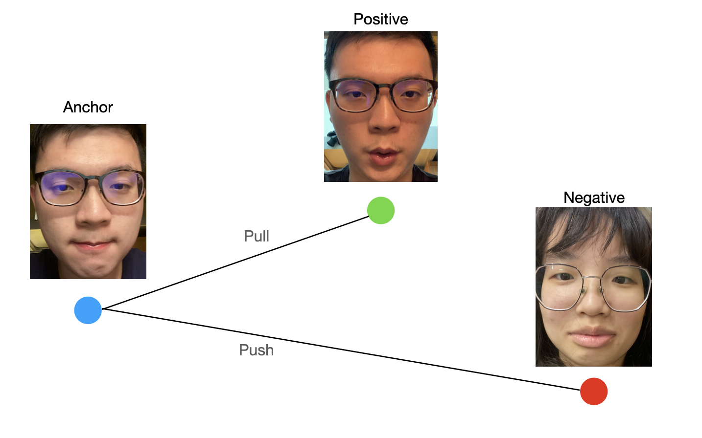
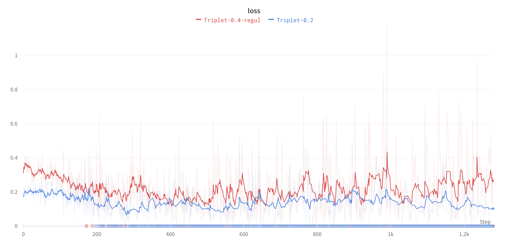
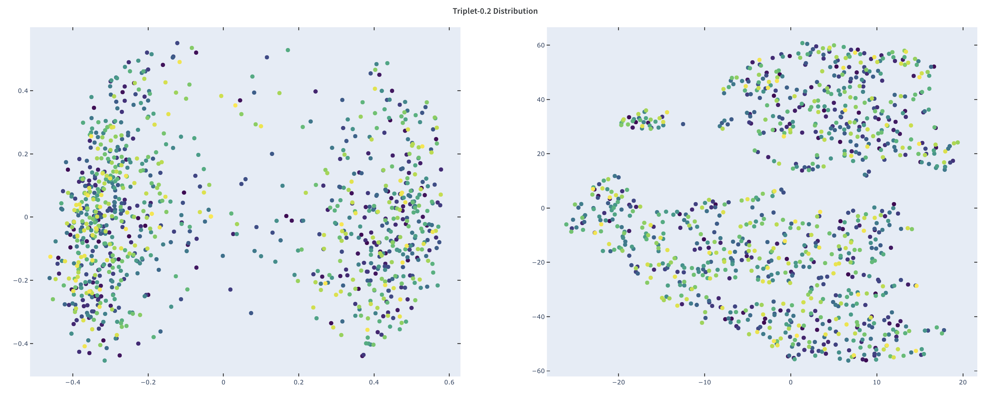
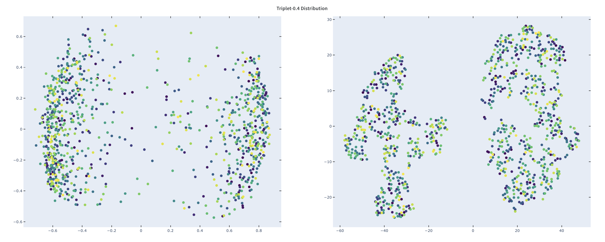
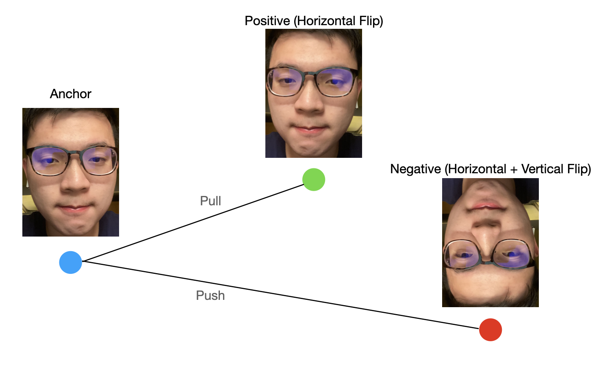
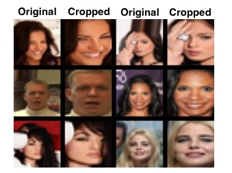

<h1 align="center">
  FISON
</h1>

<h4 align="center">
  Facial Identity system on Jetson Nano
</h4>

[](https://youtu.be/V-_LuZgbhTs)
> [Chinese version link](https://www.youtube.com/watch?v=sGgdkX3Jzwo)

## A. Introduction

This project is to utilize facial recognition to create a facial identity system. Our backend is constructed by one-shot models which is more flexible for adding a new face. The system is built on personal computer and Jetson Nano. Jetson Nano is used to recognized the faces and upload the detected information to Firebase. Users who use our application with account and password can log in to control the database and obtain the information.

### Folder structure

```
| - backend - For Personal computer
|
| - csv_file - Contribution for the CelebA dataset
|
| - jetson - Files for Jetson Nano
|
| - model - Model we used for training and detecting
```

### Features

Our facial identity system includes below features:

* One-shot face recognition, add your faces without extra training
* Complete database operation (upload, delete, update)
* Fine-tuned your model at any time
* Used as a monitor
* Visualize the features

## B. Installation

### Personal computer

```shell
$ pip install -r backend/requirements.txt
```

### Jetson Nano

```shell
$ pip install -r jetson/requirements.txt
```

### Increase swap space on Jetson Nano (Optional)

> Our nano would crush when using cuda until we increase its swap memory 🥳

```shell
# 4.0G is the swap space
$ sudo fallocate -l 4.0G /swapfile
$ sudo chmod 600 /swapfile
$ sudo mkswap /swapfile
$ sudo swapon /swapfile

# Create swap memory on every reboot
$ sudo bash -c 'echo "/var/swapfile swap swap defaults 0 0" >> /etc/fstab'
```

## C. Preparation
> This section is to help users to set up facial identity system. The required materials are listed below:
> * 1 Camera 
> * 1 button 
> * 1 RGB LED 
> * 4 1K Resistor

### Jetson Nano GPIO
<p align="center">
    
</p>

### Backend

#### 1. Set up the Firebase Realtime Database
a. Create a project in [Firebase](https://console.firebase.google.com)  
b. Select the project created in step 1, and click the **Realtime Database** on the left sidebar  
c. Copy the link, which looks like `https://<project-name>-default-rtdb.<place>.firebasedatabase.app/`  
d. Replace `<your firebase url>` in **line 117** in `backend/main.py` and **line 234** in `jetson/main.py` with your link  

#### 2. Set up the Google Cloud Storage
a. Activate the [Authentication](https://cloud.google.com/docs/authentication/getting-started) and get the json file  
b. [Create Cloud Storage bucket](https://cloud.google.com/storage/docs/creating-buckets)  
c. Replace `<your json file>` in **line 110** in `backend/main.py` and **line 224** in `jetson/main.py` with the location of your json file  

## D. Training
User can train the model by:
```shell
$ python model/triplet/train.py \
    --csv_path "<csv file>" \
    --img_root "<root for the training file>" \
    --weight "<place to save the weight file>"
```

> See more arguments in `model/triplet/train.py`

## E. Experiments
### Training details
<p align="center">

<br/>Illustration of Triplet loss
</p>

> We refer to [Tamer Thamoqa's repo](https://github.com/tamerthamoqa/facenet-pytorch-glint360k) for training our model 

| Hyper-parameters | Setup                          |
|------------------|--------------------------------|
| Batch size       | 128                            |
| Epochs           | 80                             |
| Backend          | ResNet18                       |
| Output features  | 256                            |
| Margin           | 0.4 (with weight decay) or 0.2 |
| Loss function    | Triplet Loss                   |

* Triplet-0.4-regul: With margin 0.4 and trained with regularization
* Triplet-0.2: With margin 0.2

#### Loss


#### Distribution plot

<p align="center">
    
    
    (Left.) PCA. (Right.) TSNE
</p>

### Result for real-time training
In order to train the model without extra label, we design a self-supervised learning method based on original triplet loss.
* Anchor image is the original image
* Positive image is the horizontal flip image derived from the original image
* Negative image is made by both vertical and horizontal flip on the original image.

<p align="center">
    
    <br/>Illustration of Triplet loss
</p>

> The experiment was examined on `triplet-0.4-regul.pt`
<table>
    <tr>
        <td colspan="2">Type</td>
        <td>Original</td>
        <td>New</td>
    </tr>
    <tr>
        <td rowspan="2">Cosine Similarity</td>
        <td>Positive</td>
        <td>0.9995</td>
        <td>0.9893</td>
    </tr>
    <tr>
        <td>Negative</td>
        <td>0.7687</td>
        <td>0.3886</td>
    </tr>
    <tr>
        <td rowspan="2">L2 Distance</td>
        <td>Positive</td>
        <td>0.0306</td>
        <td>0.1464</td>
    </tr>
    <tr>
        <td>Negative</td>
        <td>0.6802</td>
        <td>1.1058</td>
    </tr>
</table>

### Run time using different methods

* **second per image (s / img)**

| CPU (Pytorch) | Cuda (Pytorch) |  ONNX   | TensorRT |
|:-------------:|:--------------:|:-------:|:--------:|
|     4.11s     |    75.329s     | 0.1260s |  1.975s  |

> It is surprising that cuda consumes lots of time. We guess it is because cuda rely on huge amount of swap memory that slow down its runtime 😢.

## F. Contribution to CelebA

In order to train one-shot model, we obtain the face's coordinates beforehand. All files are placed in `csv_file`.
> The coordinates were obtained from [facenet-pytorch](https://github.com/timesler/facenet-pytorch)

| File name         | Description                                                                       |
|-------------------|-----------------------------------------------------------------------------------|
| `id_multiple.csv` | To ensure each celebrity have at least two images (For positive usage).           |
| `cropped.csv`     | Include the face's coordinates and ensure each celebrity has at least two images. |



## F. Citation

```bib
@inproceedings{liu2015faceattributes,
  title = {Deep Learning Face Attributes in the Wild},
  author = {Liu, Ziwei and Luo, Ping and Wang, Xiaogang and Tang, Xiaoou},
  booktitle = {Proceedings of International Conference on Computer Vision (ICCV)},
  month = {December},
  year = {2015} 
}

@inproceedings{koch2015siamese,
  title={Siamese neural networks for one-shot image recognition},
  author={Koch, Gregory and Zemel, Richard and Salakhutdinov, Ruslan and others},
  booktitle={ICML deep learning workshop},
  volume={2},
  year={2015},
  organization={Lille}
}

@inproceedings{chen2020simple,
  title={A simple framework for contrastive learning of visual representations},
  author={Chen, Ting and Kornblith, Simon and Norouzi, Mohammad and Hinton, Geoffrey},
  booktitle={International conference on machine learning},
  pages={1597--1607},
  year={2020},
  organization={PMLR}
}

@inproceedings{schroff2015facenet,
  title={Facenet: A unified embedding for face recognition and clustering},
  author={Schroff, Florian and Kalenichenko, Dmitry and Philbin, James},
  booktitle={Proceedings of the IEEE conference on computer vision and pattern recognition},
  pages={815--823},
  year={2015}
}

@misc{wandb,
    title = {Experiment Tracking with Weights and Biases},
    year = {2020},
    note = {Software available from wandb.com},
    url={https://www.wandb.com/},
    author = {Biewald, Lukas},
}

```
